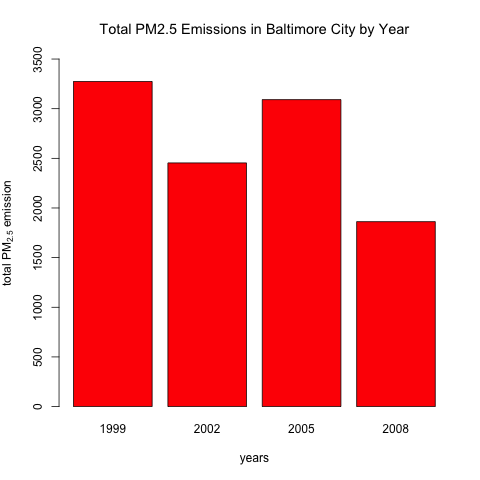

# Exploratory_data_analysis_Course_project_2
Latife Vergili  
April 28, 2016  


##Instruction
  Fine particulate matter (PM2.5) is an ambient air pollutant for which there is strong evidence that it is harmful to human health. In the United States, the Environmental Protection Agency (EPA) is tasked with setting national ambient air quality standards for fine PM and for tracking the emissions of this pollutant into the atmosphere. Approximatly every 3 years, the EPA releases its database on emissions of PM2.5. This database is known as the National Emissions Inventory (NEI). You can read more information about the NEI at the [EPA National Emissions Inventory web site](https://www.epa.gov/air-emissions-inventories/national-emissions-inventory).
  
  For each year and for each type of PM source, the NEI records how many tons of PM2.5 were emitted from that source over the course of the entire year. The data that you will use for this assignment are for 1999, 2002, 2005, and 2008.
  
###Data

  The data for this assignment are available from the course web site as a single zip file:
  
  [Data:](https://d396qusza40orc.cloudfront.net/exdata%2Fdata%2FNEI_data.zip)(29 MB)
  
  The zip file contains two files:

  PM2.5 Emissions Data (summarySCC_PM25.rds): This file contains a data frame with all of the PM2.5 emissions data for 1999, 2002, 2005, and 2008. For each year, the table contains number of tons of PM2.5 emitted from a specific type of source for the entire year. Here are the first few rows.
  

```
##     fips      SCC Pollutant Emissions  type year
## 4  09001 10100401  PM25-PRI    15.714 POINT 1999
## 8  09001 10100404  PM25-PRI   234.178 POINT 1999
## 12 09001 10100501  PM25-PRI     0.128 POINT 1999
## 16 09001 10200401  PM25-PRI     2.036 POINT 1999
## 20 09001 10200504  PM25-PRI     0.388 POINT 1999
## 24 09001 10200602  PM25-PRI     1.490 POINT 1999
```


  - fips: A five-digit number (represented as a string) indicating the U.S. county   
  - SCC: The name of the source as indicated by a digit string (see source code classification table)   
  - Pollutant: A string indicating the pollutant  
  - Emissions: Amount of PM2.5 emitted, in tons  
  - type: The type of source (point, non-point, on-road, or non-road)   
  - year: The year of emissions recorded  
  
  Source Classification Code Table (Source_Classification_Code.rds): This table provides a mapping from the SCC digit strings in the Emissions table to the actual name of the PM2.5 source. The sources are categorized in a few different ways from more general to more specific and you may choose to explore whatever categories you think are most useful. For example, source “10100101” is known as “Ext Comb /Electric Gen /Anthracite Coal /Pulverized Coal”.

You can read each of the two files using the readRDS() function in R. For example, reading in each file can be done with the following code:
  
  This first line will likely take a few seconds. Be patient!

```r
NEI <- readRDS("summarySCC_PM25.rds")
SCC <- readRDS("Source_Classification_Code.rds")
```

as long as each of those files is in your current working directory (check by calling dir() and see if those files are in the listing).

##Assignment

The overall goal of this assignment is to explore the National Emissions Inventory database and see what it say about fine particulate matter pollution in the United states over the 10-year period 1999–2008. You may use any R package you want to support your analysis.

###Questions

  You must address the following questions and tasks in your exploratory analysis. For each question/task you will need to make a single plot. Unless specified, you can use any plotting system in R to make your plot.
  
  1.  Have total emissions from PM2.5 decreased in the United States from 1999 to 2008? Using the base plotting system, make a plot showing the total PM2.5 emission from all sources for each of the years 1999, 2002, 2005, and 2008.

  
<!-- -->
  
  As It can be seen from bar plot, total emission from PM2.5 decreased in the US from 1999 to 2008.
  
  2. Have total emissions from PM2.5 decreased in the Baltimore City, Maryland (fips == "24510") from 1999 to 2008? Use the base plotting system to make a plot answering this question.
  
  
  

<!-- -->

  Acoording to the bar plot, PM2.5 emissions's  level is fluctuating between 1999 and 2008. From 1999 to 2002, PM2.5 level is decreasing. However, after 2002, PM2.5 is increasing until 2005, then begin to decrease until 2008.
  
  3. Of the four types of sources indicated by the type (point, nonpoint, onroad, nonroad) variable, which of these four sources have seen decreases in emissions from 1999–2008 for Baltimore City? Which have seen increases in emissions from 1999–2008? Use the ggplot2 plotting system to make a plot answer this question.
  

```
## Warning: package 'ggplot2' was built under R version 3.2.4
```

<!-- -->
  
  
  * __NonPoint(green line):__ As we can see from the plot, nonpoint (green line) is sharply decreasing from 1999 to 2002. Then, it is remaining steady from 2002 to 2005 at 1500 tons total emissions. After 2005, it is slightly decreasing until 2008.  
  * __Point(purple line):__ Total emissions from this source is slightly increasing between 1999 and 2002, and sharply increasing between 2002 and 2005. After 2005, it has sharp decrease until 2008.  
  * __On-Road(blue line):__ Total emissions from this source is slightly decreasing between 1999 and 2002, and remaining steady between 2002 and 2005. After 2005, it is getting decrease slightly until 2008.  
  * __Non-Road(red line):__ Total emissions from the non-road source has similar behaviour between 1999 and 2005. After 2005, it has more sharply decrease than on-road emission source.  
  
  4. Across the United States, how have emissions from coal combustion-related sources changed from 1999–2008?
  
  To do this, first, we need to define coal combustion related sources. Is is investigated closely from [this](https://www3.epa.gov/air/emissions/basic.htm) web page. Those sources are under Short.Name column in "Source_Classification_Code.rds" (renamed as SCC) file. After this step, it can be merged two (NEI and grepped source data sets) data sets. 
  
<!-- -->

  Even total emissions from coal related sources is slightly increased(564 to 569 kilotons) from 2002 to 2005, it is overal decreased.
  
  5. How have emissions from motor vehicle sources changed from 1999–2008 in Baltimore City?
  
  The type ON-ROAD was used as an indicator of motor vehicle emissions. So we need to subset data for Baltimore (fips=="24510") and emissions from motor vehicle sources. 

<!-- -->

    Emissions from motor vehicle sources has decreased from 1999 to 2008.
    
  6. Compare emissions from motor vehicle sources in Baltimore City with emissions from motor vehicle sources in Los Angeles County, California (fips == "06037"). Which city has seen greater changes 


<!-- -->

  As it can be seen from plot, PM2.5 emissions coming from the motor vehicles in Los Angeles is much higher than Baltimore. Emissions levels in Baltimore decrease from 1999 to 2008. However, emissions levels in LA increase from 1999 to 2005 and decrease until 2008. 
